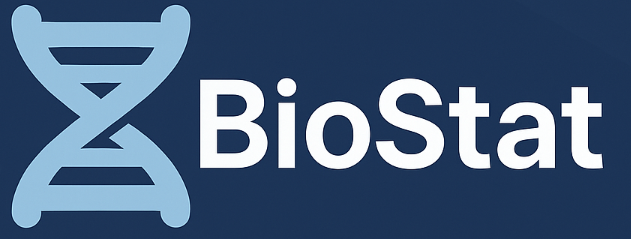

<p align="center">  </p>

**BioStat 2.0** is a disease-agnostic, web-based biomarker analysis platform. It is designed to help clinicians, researchers, and healthcare professionals interpret biomarker datasets in an intuitive and visual way. The platform allows users to upload CSV files and generate statistical summaries, visualizations, and patient-level insights. 

Video tutorial: https://www.youtube.com/watch?v=yUdVqCBfiv8

---

## Purpose

Medicine relies on biomarkers to support early diagnosis and disease monitoring. However, many clinicians lack access to tools that allow them to quickly explore biomarker data without coding experience or complex workflows.

I created BioStat to:

* Provide an accessible way to analyze biomarker data
* Support **any disease/ cancer type**
* Offer **clear statistical summaries and visualizations** 
* Enable rapid exploration of patient-level trends

---

## Who This App Is For

* Clinicians exploring biomarker trends
* Researchers analyzing biomarker datasets 
* Students and trainees learning about biomarker-based analysis
* Anyone working with structured biomarker data in CSV 

---

## Data Requirements

BioStat accepts datasets in **CSV (Comma-Separated Values)** format.

### Required Data Characteristics

* The dataset must contain **numerical biomarker values**
* Non-numerical columns (e.g., patient IDs, labels, notes) are allowed
* Each column should represent a biomarker or metadata field

The dataset may be:

* Fully cleaned
* Partially cleaned
* Raw (uncleaned)

BioStat will automatically process and filter out non-numerical columns for analysis.

---

## Example Public Datasets

BioStat is compatible with many publicly available biomarker datasets for numerous diseases, including:

* Ovarian cancer: https://www.kaggle.com/datasets/saurabhshahane/predict-ovarian-cancer?resource=download 
* Parkinson’s disease: https://www.kaggle.com/datasets/ruslankl/early-biomarkers-of-parkinsons-disease 
* Pancreatic cancer: https://www.kaggle.com/datasets/johnjdavisiv/urinary-biomarkers-for-pancreatic-cancer

Public datasets from platforms such as Kaggle can be used if they are in CSV format.

---

## How to Access BioStat

1. Open the BioStat web application in your browser: https://aarnavg54.github.io/BioStat-Disease-Biomarker-Analyzer/
2. No account or login is required
3. All analysis is performed live for fast interaction

---

## Key Features

* Disease-agnostic biomarker analysis
* CSV-based data handling
* Automatic numerical feature detection
* Interactive statistical charts
* Clean, clinician-friendly interface
* No programming required


---

## Disclaimer

* BioStat is intended for **research and exploratory use only**
* It does **not provide medical diagnoses or treatment recommendations**
* Users are responsible for ensuring data quality and ethical use

---

## Tools & Technologies
Frontend
- HTML5: Semantic structure and layout
- CSS3: Responsive styling and layout management
- JavaScript (Vanilla): Core application logic and interactivity

Data Processing & Visualization
- PapaParse – Client-side CSV parsing and data ingestion
- Chart.js – Interactive statistical charts and visualizations

## Setup & Run Instructions

Option 1: Run Online (Recommended)

- Open the live application in your browser:
https://aarnavg54.github.io/BioStat-Disease-Biomarker-Analyzer/

- Upload a CSV file containing biomarker data

- Explore statistical summaries, visualizations, risk assessment, and multi-dataset comparisons

No installation, account, or configuration is required.

Option 2: Run Locally

Clone the repository:
```bash
git clone https://github.com/aarnavg54/BioStat-Disease-Biomarker-Analyzer.git
Navigate to the project directory:

bash
Copy code
cd BioStat-Disease-Biomarker-Analyzer
Open index.html in a modern web browser.

Optional: Run a local server for best performance:

bash
Copy code
python -m http.server
Then open:
http://localhost:8000


---
## Contact

For questions, feedback, or contributions, please contact me at aarnavg54@gmail.com
